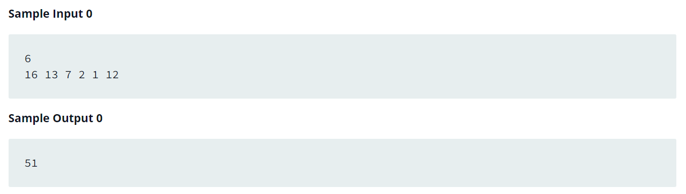

Source: https://www.hackerrank.com/challenges/1d-arrays-in-c/problem?isFullScreen=false

Problem: Create an array of size n dynamically, and read the values from stdin. Iterate the array calculating the sum of all elements. Print the sum and free the memory where the array is stored.

Example: 

