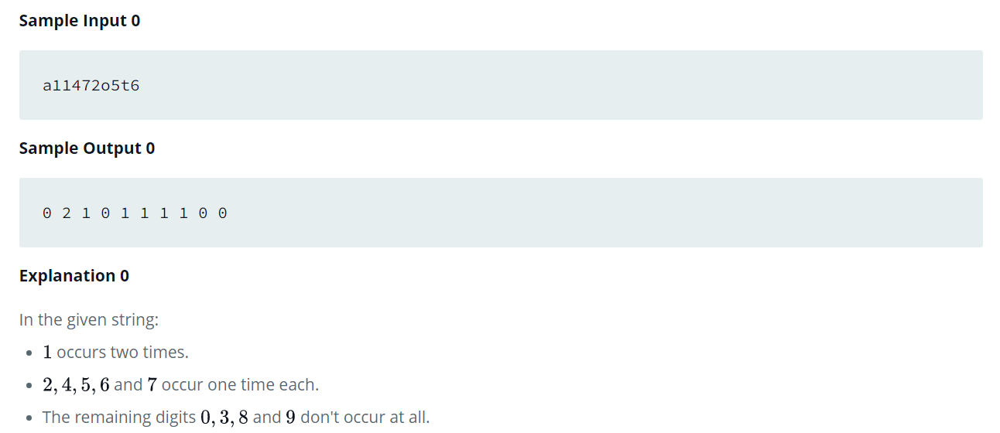

Source: https://www.hackerrank.com/challenges/frequency-of-digits-1/problem?isFullScreen=false

Problem: Given a string, s, consisting of alphabets and digits, find the frequency of each digit in the given string.

Example: 

