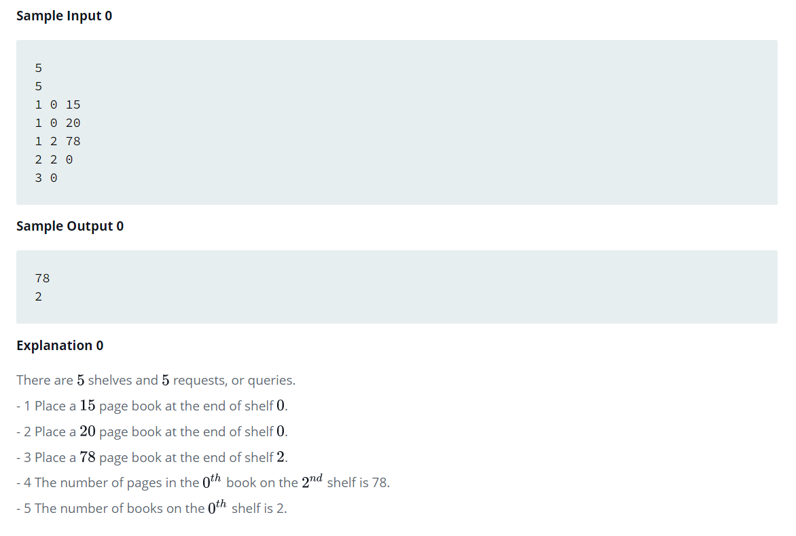

Source: https://www.hackerrank.com/challenges/dynamic-array-in-c/problem

Problem: Snow Howler is the librarian at the central library of the city of HuskyLand. He must handle requests which come in the following forms:

1 x y : Insert a book with y pages at the end of the xth shelf.

2 x y : Print the number of pages in the yth book on the xth shelf.

3 x : Print the number of books on the xth shelf.

Snow Howler has got an assistant, Oshie, provided by the Department of Education. Although inexperienced, Oshie can handle all of the queries of types 2 and 3.

Help Snow Howler deal with all the queries of type 1.

Example: 

