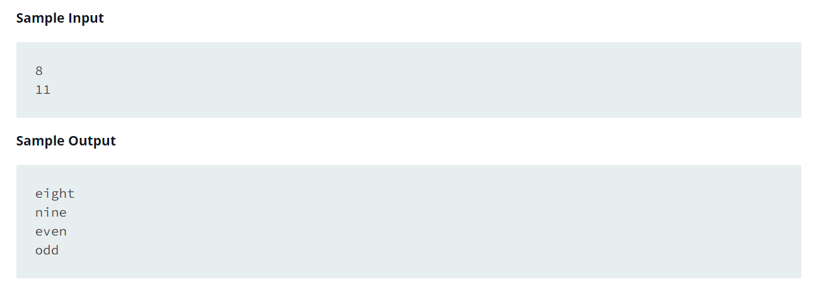

Source: https://www.hackerrank.com/challenges/for-loop-in-c/problem

Problem: For each integer c in the interval  [a,b](given as input):

    - If 1 <= n <= 9, then print the English representation of it in lowercase. That is "one" for 1, "two" for 2, and so on.
    
    - Else if n > 9 and it is an even number, then print "even".

    - Else if n > 9 and it is an odd number, then print "odd".

Example: 

