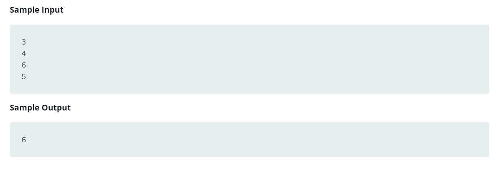

Source: https://www.hackerrank.com/challenges/functions-in-c/problem?isFullScreen=false

Problem: Write a function int max_of_four(int a, int b, int c, int d) which reads four arguments and returns the greatest of them

Example: 

