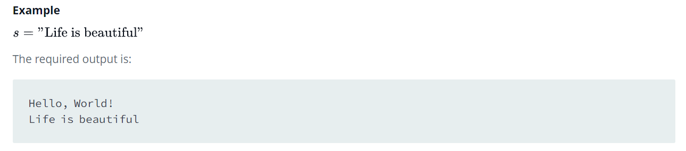

Source: https://www.hackerrank.com/challenges/hello-world-c/problem?isFullScreen=false

Problem: This challenge requires you to print Hello, World! on a single line, and then print the already provided input string to stdout. If you are not familiar with C, you may want to read about the printf() command.

Example: 

