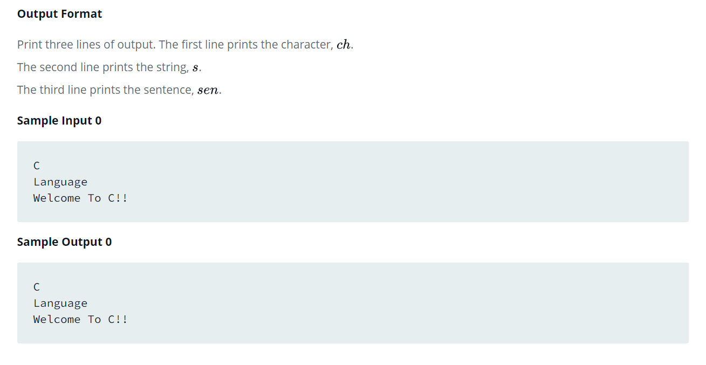

Source: https://www.hackerrank.com/challenges/playing-with-characters/problem?isFullScreen=false

Problem: You have to print the character, ch, in the first line. Then print  in next line. In the last line print the sentence, sen.

Example: 

