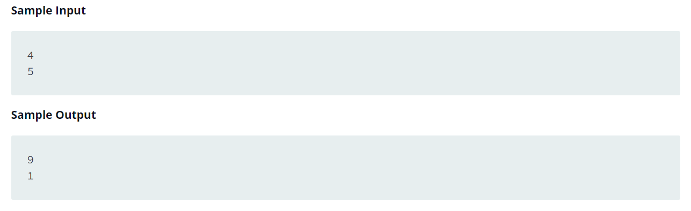

Source: https://www.hackerrank.com/challenges/pointer-in-c/problem?isFullScreen=false

Problem: Complete the function void update(int *a,int *b). It receives two integer pointers, int* a and int* b. Set the value of a to their sum, and v to their absolute difference. There is no return value, and no return statement is needed.

    - a' = a + b

    - b' = |a - b|

Example: 

