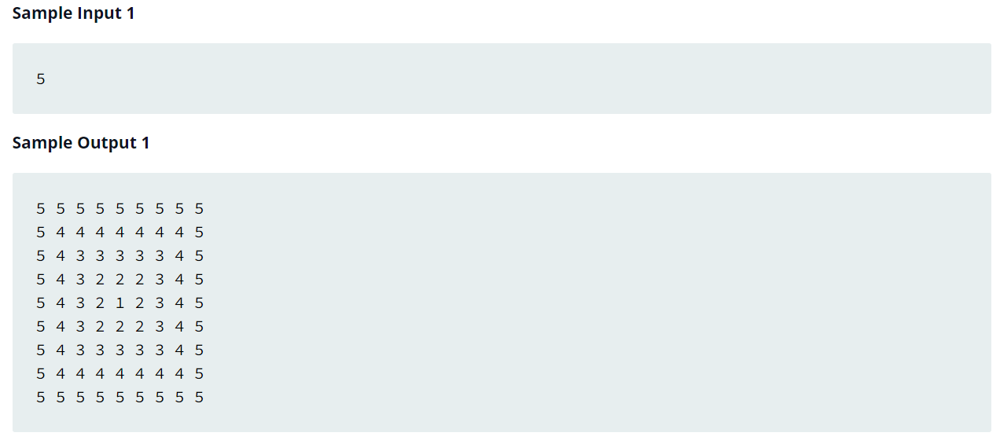

Source: https://www.hackerrank.com/challenges/printing-pattern-2/problem

Problem: Print a pattern of numbers from 1 to n as shown below. Each of the numbers is separated by a single space.

4 4 4 4 4 4 4  

4 3 3 3 3 3 4   

4 3 2 2 2 3 4   

4 3 2 1 2 3 4   

4 3 2 2 2 3 4   

4 3 3 3 3 3 4   

4 4 4 4 4 4 4  

Example: 

